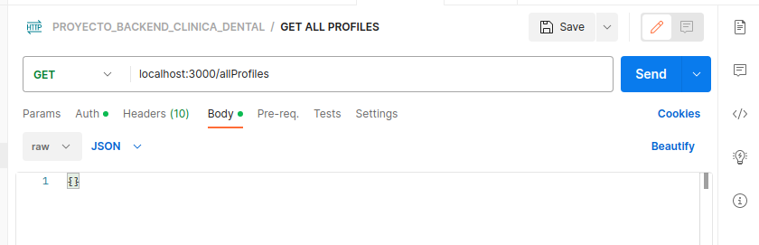
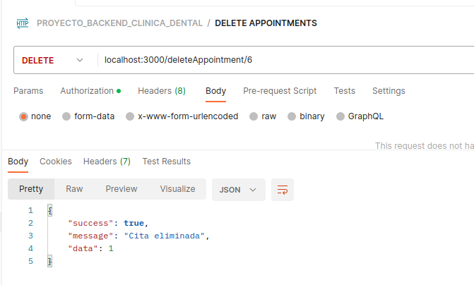

### 4º Proyecto GeekHubs Academy: 
# Backend Clinica Dental con base de datos.

  
Contenido 📝

  <ol>
    <li><a href="#finalidad">Objetivo</a></li>
    <li><a href="#acerca-de">Acerca de</a></li>
    <li><a href="#diagrama-er">Diagrama Entidad Relación</a></li>
    <li><a href="#tecnologías-utilizadas">Tecnologías utilizadas</a></li>
    <li><a href="#instalación-en-local">Instalación en local</a></li>
    <li><a href="#endpoints">Endpoints</a></li>
    <li><a href="#agradecimientos">Agradecimientos</a></li>
    <li><a href="#repositorio">Contacto</a></li>
    <li><a href="#licencia">Licencia</a></li>
  </ol>

## Finalidad
Este proyecto requería una API funcional conectada a una base de datos en la que poder hacer consultas como ver, crear, modificar y eliminar usuarios y citas.

## Acerca de
He desarroyado esta API para el 4º proyecto del **Bootcamp de Full Stack Developer de Geekshubs Academy**. Se basa en un backend de una app de una clínica dental. Se usa postman para hacer las consultas y es totalmente funcional.
## Diagrama Entidad Relación

## Tecnologías utilizadas
         

## Instalación en local
1. Clonar el repositorio
2. ` $ npm install `
3. Conectamos nuestro repositorio con la base de datos
4. Ejecutamos las migraciones
` $ sequelize db:migrate `
5. Ejecutamos los seeders
` $ sequelize db:seed:all `
6. Levantamos el servidor de express
` $ npm run dev `

## 
Endpoints

Endpoints

- **auth**
    - **/register**
    
    

    - **/login**
    
    

    **Token**
    
    Copias el token y lo pegas aqui: 
    

    **/getProfile**
    Una vez introducido el token de ese usuario:
    
    

    **/getAllProfiles**
    Debes logearte como admin previamente:
    
    

    **/updateProfile**
    

    **/createAppointmet**
    

    **/getAllAppointments**
    Todas las citas de un usuario:
    

    **/updateAppointment**
    Has de poner el id de la cita en la ruta:
    

    **/deleteAppointments**
    

    **/getAllAppointmentsByDoctor**
    Debes logearte como Doctor previamente:
    

            

## Agradecimientos
**Agradezco a mis profesores, sobre todo a DANI el tiempo dedicado a mis dudas y problemas que han ido surgiendo.**

**También agradezco la ayuda recibida por todos mis compañeros, sobre todo a Marta, Edu, Jesus, Alex y Carlos por su gran apoyo en momentos difíciles del proyecto, son los que mas me han apoyado. Muchas gracias.**

## Repositorio
https://github.com/xIMet3/baseDatosDentista

## Licencia
Este proyecto se ha realizado bajo la **licencia MIT**.